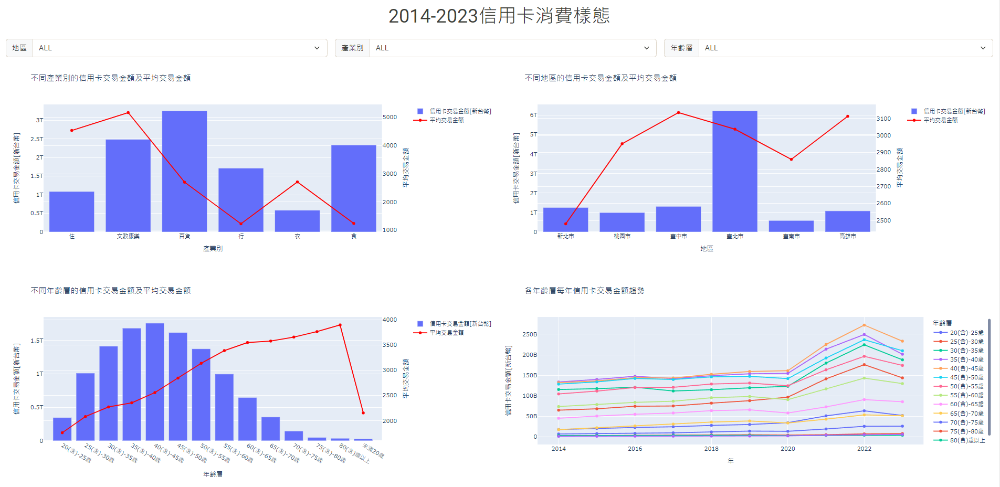
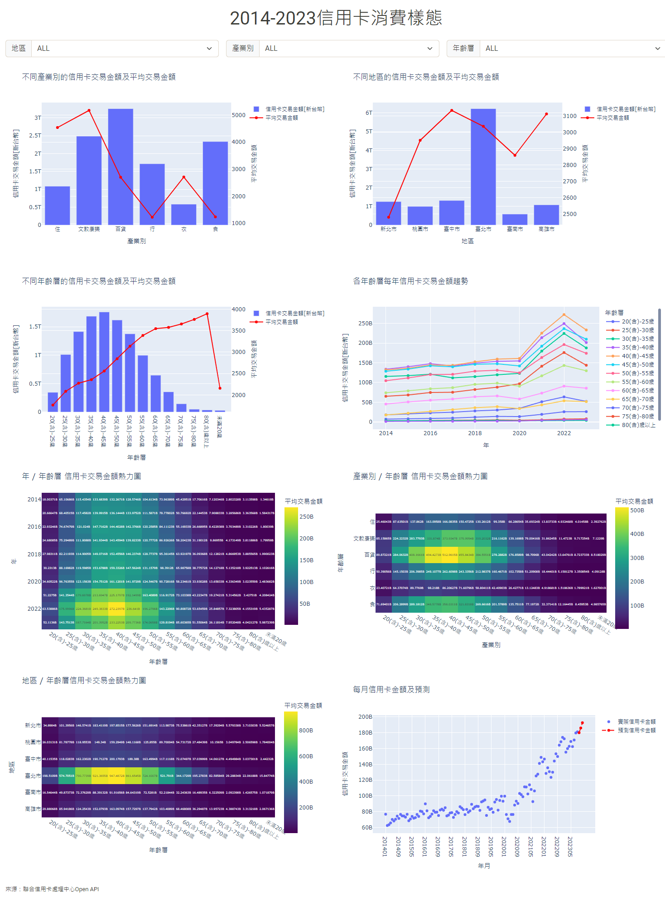

# 信用卡消費樣態_ML

###### 連結：[2014-2023信用卡消費樣態](https://dash-ml-knot.onrender.com)

## Dash

## 說明
依不同需求，選擇相應資料：
1. 地區 [六都]：臺北市 | 新北市 | 桃園市 | 臺中市 | 臺南市 | 高雄市 | ALL

2. 產業別：食 | 衣 | 住 | 行 | 文教康樂 | 百貨 | ALL

3. 年齡層：未滿20歲－80歲以上 [以五歲為間距]

圖表說明：  
1. 不同產業別信用卡交易金額及平均交易金額   
2. 不同地區信用卡交易金額及平均交易金額
3. 不同年齡層信用卡交易金額及平均交易金額
4.  