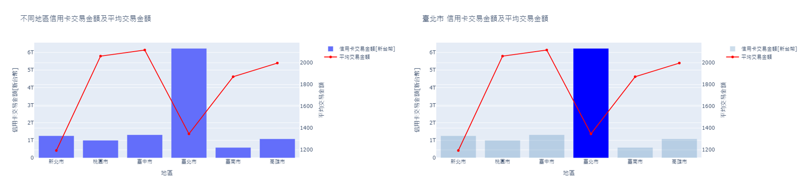

# 信用卡消費樣態_ML

###### 連結：[2014-2023信用卡消費樣態](https://dash-ml-knot.onrender.com)

## Dash

## 說明
依不同需求，選擇相應資料：
1. 地區 [六都]：臺北市 | 新北市 | 桃園市 | 臺中市 | 臺南市 | 高雄市 | ALL

2. 產業別：食 | 衣 | 住 | 行 | 文教康樂 | 百貨 | ALL

3. 年齡層：未滿20歲－80歲以上 [以五歲為間距]

圖表說明：  
一、長條圖及折線圖 [隨著篩選按鈕變化而變化]  
1. 不同產業別信用卡交易金額及平均交易金額  
   
2. 不同地區信用卡交易金額及平均交易金額  

3. 不同年齡層信用卡交易金額及平均交易金額  

4. 不同年齡層每年信用卡交易金額趨勢  
 

二、熱力圖  
1. 年 / 年齡層信用卡平均交易金額熱力圖   

2. 產業別 / 年齡層信用卡平均交易金額熱力圖  

3. 地區 / 年齡層 信用卡平均交易金額熱力圖  

三、模型  
1. 多元線性迴歸模型  
顯示2014年1月份至2023年9月份期間每月份的信用卡交易金額及趨勢，由圖可觀察出信用卡交易金額逐年增加，則最後三個紅點為透過多元線性迴歸模型預測出10,11,12三月份的信用卡交易金額。

# 專題組員
盧宗基、林玫蓀、李亦宣
# 專題目的
感於近年來受疫情影響，國人消費形態及支付方式改變，網路交易及外送盛行，希望藉由國人消費様態分析作為發卡及收單機構推廣特約商店及行銷推廣之參考，並預估下月份之信用卡消費金額。
# 資料說明
1. 資料來源：聯合信用卡處理中心 OPEN API
2. 資料範圍：2014年1月 - 2023年9月